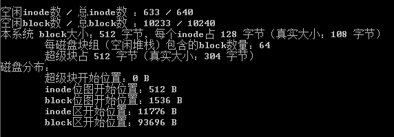
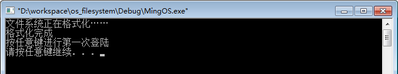
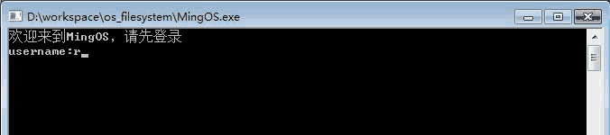
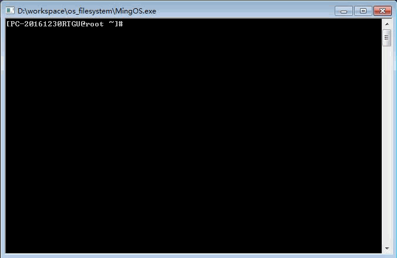
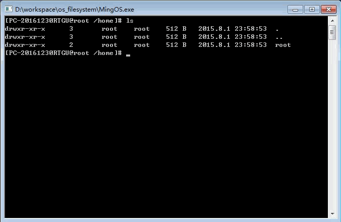
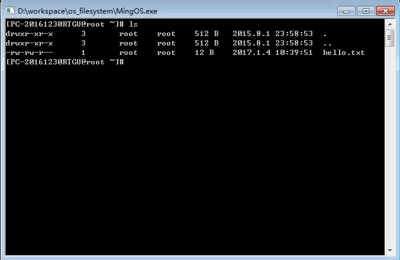
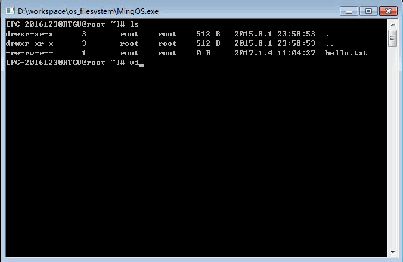
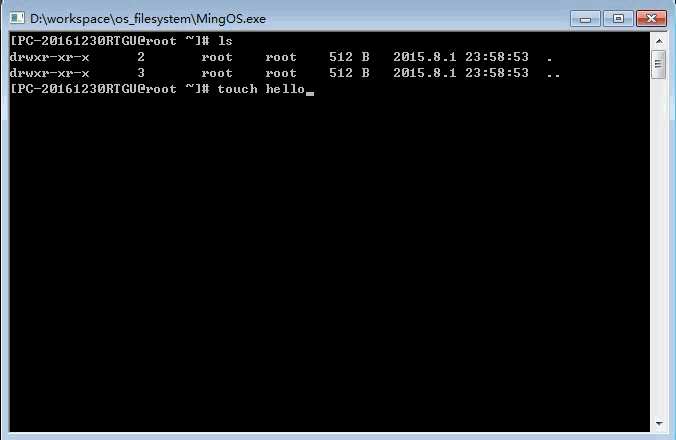
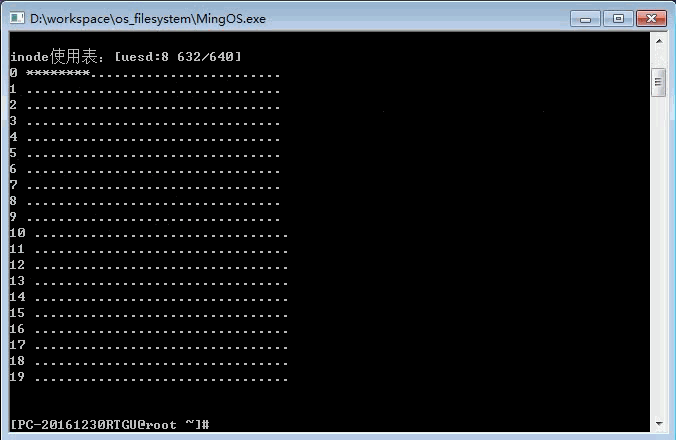
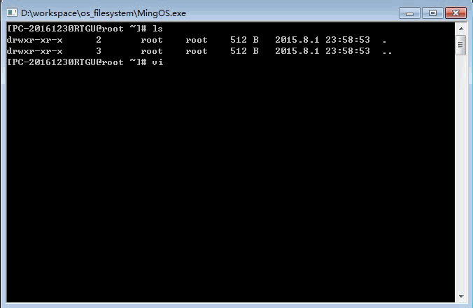

# os_filesystem - 一个虚拟文件系统（C++）

## 简介
这是一个仿linux的虚拟文件系统，系统由一个虚拟磁盘文件承载，以文件读写模拟磁盘读写，不涉及底层驱动。

写一个简单的仿linux文件系统，首先需要设计好包含inode、block、superblock、虚拟磁盘布局，空间分配等信息的基本框架。文件系统的开头是一个superblock，包含系统的重要信息，包括inode和block的数量和大小。对于inode，一般来说需要占磁盘空间的百分之一，不过这是个小系统，总大小才5M多一点，所以分配给inode区的空间很少，剩下的空间大部分是block区。

该文件系统的总体规划如下：  

由于写程序的时候时间比较紧张，只写了4天就去验收，所以代码没来得及优化，有的地方会显得冗余，大家不要见怪。

虽然时间有限，不过也额外实现了一个vi编辑器的功能，写的比较简陋，代码也很乱，有时间改进一下。

总的来说，代码还有待优化，欢迎多提意见，多挑毛病。

## 如何使用
### step 1：下载项目
`git clone https://github.com/windcode/os_filesystem.git`

### step 2：用VC++6.0打开项目
双击目录中的 **MingOS.dsw** 文件，或者将该文件拖到VC++6.0界面中。

### step 3：编译，链接，运行

### 或者
### step 1：直接运行 **/Debug** 文件夹下 **MingOS.exe** 文件体验文件系统

## 特性
* 初次运行，创建虚拟磁盘文件

* 登录系统

默认用户为root，密码为root

* 帮助命令（help）

* 用户添加、删除、登录、注销（useradd、userdel、logout）

* 修改文件或目录权限（chmod）

* 写入、读取受权限限制

* 文件/文件夹添加、删除（touch、rm、mkdir、rmdir）

* 查看系统信息（super、inode、block）

* 仿写一个vi文本编辑器（vi）

* 索引节点inode管理文件和目录信息

* 使用 **成组链接法** 管理空闲block的分配  
	* **block分配过程：**
当需要分配一个block的时候，空闲块堆栈顶拿出一个空闲块地址作为新分配的block。
当栈空的时候，将栈底地址代表的空闲块中堆栈作为新的空闲块堆栈。  
	* **block回收过程：**
当回收一个block的时候，检查堆栈是否已满，如果不满，当前堆栈指针上移，将要回收的block地址放在新的栈顶。
如果堆栈已满，则将要回收的block作为新的空闲块堆栈，将这个空闲块堆栈栈底元素地址置为刚才的空闲块堆栈。  
	* 分配和回收的同时需要更新block位图，以及超级块。

* inode的分配/回收  
	* inode的分配和回收较为简单，采用顺序分配和回收。  
	* 需要分配时，从inode位图中顺序查找一个空闲的inode，查找成功返回inode的编号。
	* 回收的时候，更新inode位图即可。  
	* 分配和回收都需要更新inode位图。

## 注意
* 运行环境为VC++6.0